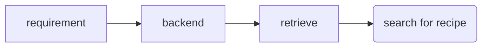

# Meeting 1

## 27th October 2020

Shopping list available on BBC food.

scraped BBC recipes.

used filtering to gen new recipe.

underutilised crop project.

## 1st Project Idea:

* Focus on underutilised crops.
* Focus on possible supplements.
* Has bio info.
* Compare nutrition.

## 2nd Project Idea

* Personalised daily recipe generation.
* Sepecific nutritional requirements.
* alg to gen recipes of a day.
* Start with focus on common ingredients?
* Use GA

Create Kaggle Account
Use Jupyter Notebook to become familiar with pandas

## 3rd Project Idea

* Carry on old project.
* Evaluate by cooking.

Create scenario.

Take input and sort out requirements.

Retrieve something from server, combine relevant information.

Make a flowchart, self aware design, need chapter specifying each modules' design.

Search for self aware spec (detailed design for each component).

Take estimation for recipe nutrition (if not supplied), **this is extra complexity**.

Formalise design with flow charts.

## Overview

UX design, UI design.

## Goal For Next Week

1. Search for recipe by ingredient.
2. +++ Multiple ingredient query.
3. ++++ Query for calories as well.
4. Proposal form ---> week after next.
   1. Express what purpose of project is.
      1. Good for sustainability/health/new recipes exploring.
   2. How to achieve the goal.
   3. Say something about the problem.
   4. How to evaluate the system.
   5. Search for some formal publications.

# Meeting 2

## 6th November 2020

## Goal For Next Week

1. Data cleaning (first example would be NaN in calories).
2. Find other value that may disqualify.
3. Add GUI
4. Search for Django Examples, and research django/flask.

1. Think about real application case.
   1. Create Database for each user.
   2. If I want to have user's saved recipes.
   3. UX for user recipes, will explore collab filtering algorithm, for meal recc.
2. Suggestions for what's next.
   1. Think about flow chart for self aware development (use lucidchart).
   2. Other is Spec.
   3. Assess Impl, components, linking backend etc.
   4. Create formula to staisfy requirements.
   5. Set up a skeleton.
3. Why are we using a GA?
   1. Don't have existing recipes nutrition facts.
   2. Take averages of recipes.
   3. Test validity of data.
      1. Should have requirement from user:
         1. Max protein, limit cal.
         2. encode ingredients using binary fashion.
      2. Fitness function how?
         1. In this case would be max protein.
         2. If using existing ratios would be a rules based system.
4. Put current prepwork onto github and give link to haixia.

# Meeting 3

Ethics, over handling of food prefernces/ allergies. Message Ben for this.
Section 3.2 -  Now we should have some plan.
Declare privacy of data, add to ethics list.

Usage of Docker

* Easier for us to manage packages and testing

Haixia suggests you don't need docker.
Even in company it's only used for testing.
Put up onto rented server.

Experience with docker for cv.

Since we're not decided what framework to go, not good to make framework yet.

Advantages with django:

Provides default text box.
Quite Organised
Don't have to create some default parts of django apps
Remember text similarities.

Response on different repos:

> If using different envs then use different repos, otherwise just use the same one.

## Goal For Next Week (or Two)

Search for templates for Django.
Look for the most information on them.

Plan database and send to Haixia.

Extras
	3 word vector
	known queries
	bird algorithm
	GA optimisation of stuff

Make a big overview (generic) of how the system will be formed.

Design a generic workflow.
Try to finish first page of frontend and test it (first week of December).
Remind about ethics form (send email to Haixia).

# Meeting 4

Work on a bit of writeup, and project work each week.

References to peer reviewed, there's no strict restriction on non-peer though.

25% is motivation and lit review.

Finding a latex template to use within the project report.

New ethics form may be more useful for me.

Use Github, Jira, Or Trello

Focus on creation of recipes for people with diabetes etc.

In terms of detailed plan first page front and abckedn, please enable login w/ facebook account. - check ethics.

First page -

> Log in, new account.
>
> Do encryption (SHA 256)

For backend please draft user table (more info required?)

Database design - look at KB ai.

Put all planning in 1 file.

All resources in a folder in file dir.

Don't cc in Ben for initial questions.

# Meeting 27/11

latex day

access of SHA 256 encrypted data in db

documentation more important than code itself.

Haixia creating plan, is going to email me, and I should change it accordingly.

When you retrieve you need to test and retrieve.

In dissertation talk about rule based, as user I input egg.
Will you retrieve eggplant eg eggplat showing up when you type egg.

Query within Django returning required elements. Look up dynamic display of content through queries.

Comparison between postgress and sql grammar stays the same. There's not really that much difference.
Some commands eg. in cmd window some stuff is different.

If you use django w/ postgress wit's really easy.
If you create class in django using python, then you can directly create database.

research some more postgress.

Just keep in mind that for latex when you have complicated formulas.