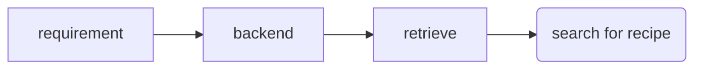

# Meeting 1

## 27th October 2020

Shopping list available on BBC food.

scraped BBC recipes.

used filtering to gen new recipe.

underutilised crop project.

## 1st Project Idea:

* Focus on underutilised crops.
* Focus on possible supplements.
* Has bio info.
* Compare nutrition.

## 2nd Project Idea

* Personalised daily recipe generation.
* Sepecific nutritional requirements.
* alg to gen recipes of a day.
* Start with focus on common ingredients?
* Use GA

Create Kaggle Account
Use Jupyter Notebook to become familiar with pandas

## 3rd Project Idea

* Carry on old project.
* Evaluate by cooking.

Create scenario.

Take input and sort out requirements.

Retrieve something from server, combine relevant information.

Make a flowchart, self aware design, need chapter specifying each modules' design.

Search for self aware spec (detailed design for each component).

Take estimation for recipe nutrition (if not supplied), **this is extra complexity**.

Formalise design with flow charts.

## Overview

UX design, UI design.

## Goal For Next Week

1. Search for recipe by ingredient.
2. +++ Multiple ingredient query.
3. ++++ Query for calories as well.
4. Proposal form ---> week after next.
   1. Express what purpose of project is.
      1. Good for sustainability/health/new recipes exploring.
   2. How to achieve the goal.
   3. Say something about the problem.
   4. How to evaluate the system.
   5. Search for some formal publications.

# Meeting 2

## 6th November 2020

## Goal For Next Week

1. Data cleaning (first example would be NaN in calories).
2. Find other value that may disqualify.
3. Add GUI
4. Search for Django Examples, and research django/flask.

1. Think about real application case.
   1. Create Database for each user.
   2. If I want to have user's saved recipes.
   3. UX for user recipes, will explore collab filtering algorithm, for meal recc.
2. Suggestions for what's next.
   1. Think about flow chart for self aware development (use lucidchart).
   2. Other is Spec.
   3. Assess Impl, components, linking backend etc.
   4. Create formula to staisfy requirements.
   5. Set up a skeleton.
3. Why are we using a GA?
   1. Don't have existing recipes nutrition facts.
   2. Take averages of recipes.
   3. Test validity of data.
      1. Should have requirement from user:
         1. Max protein, limit cal.
         2. encode ingredients using binary fashion.
      2. Fitness function how?
         1. In this case would be max protein.
         2. If using existing ratios would be a rules based system.
4. Put current prepwork onto github and give link to haixia.